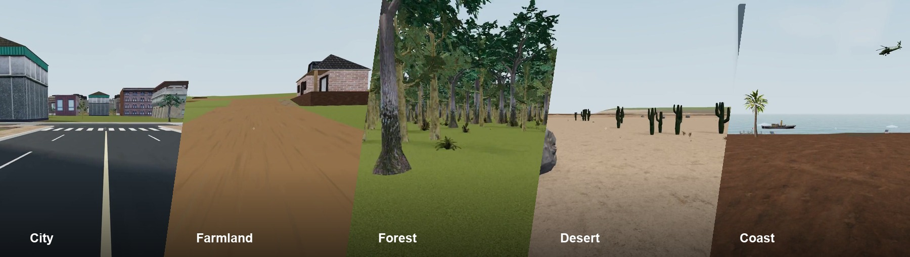

  

  
  &nbsp;
  
  &nbsp;
  

  <strong>🌍 Real-time Planning &nbsp; · &nbsp; ✏️ Language-guided Editing &nbsp; · &nbsp; 💬 Stateful NPCs &nbsp; · &nbsp; 🧠 Persistent State</strong>

---

## 🌍 A world that grows, responds, and persists

**3D worlds, generated as you explore.**

WorldStream plans and generates explorable 3D worlds in real time. Edit landscapes with language, interact with NPCs, and revisit places that preserve your changes.

  
   
  <a href="https://krennic999.github.io/WorldStream/#demo"><strong>▶ Watch the full demo · 5:17 · 1080p</strong></a>

## ✨ What makes it interactive?

Change landscapes through language. Talk to residents, call and feed animals, and return to a world that remembers your edits.

| | Capability |
| --- | --- |
| 🧭 **Plan as you move** | Plan regional structure ahead of the player; resolve local detail on approach. |
| ✏️ **Edit with language** | Add a forest and water channel to a desert through a natural-language request. |
| 💬 **Meet the inhabitants** | Ask residents for directions; call and feed animals that carry their own state and activities. |
| 🧠 **Keep the world** | Preserve object identities, layouts, and edits as distant geometry unloads. |

## ⚙️ Plan far away. Resolve nearby.

Macro plans connected regions; Micro resolves nearby detail. Local code builds playable scenes and preserves their state.

**Code and state, from plan to world.** Planning and generation use only code and structured data—no visual inputs or intermediates.

| 🌐 Macro Planner | 🔎 Micro Planner | 🛠️ Local Code |
| :--- | :--- | :--- |
| **Shape the world** | **Decide the detail** | **Build and remember** |
| Terrain, settlements, and regional roads. | Nearby streets, buildings, vegetation, and actors. | Playable geometry and persistent world state. |

  

With [Jev](https://typesafe.ai/) as planner, estimated response time drops to **~0.7 seconds**, compared with ~30 seconds for Claude.

## 💻 Code

Coming soon.
