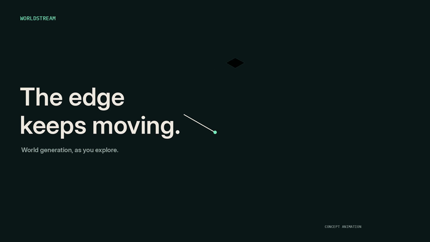

  

  
  &nbsp;
  
  &nbsp;
  

  <strong>🌍 Infinite Exploration &nbsp; · &nbsp; 🌊 Streaming Generation &nbsp; · &nbsp; ✏️ Dynamic Editing &nbsp; · &nbsp; 🧠 Persistent State</strong>

---

## 🌍 A world that grows, responds, and persists

**3D worlds, generated as you explore.**

WorldStream is designed for **infinite exploration**: regions are planned and generated on demand as you move through a continuously expanding 3D world. **Edit existing scenes and shape upcoming regions through language**, interact with NPCs, and revisit places that preserve your changes.

  

  <a href="https://pub-2294b5a012244fc48dc4db2a3b3e7fb0.r2.dev/worldstream-editorial-final-voiceover-v2.mp4"><strong>▶ Open the WorldStream trailer · 0:52 · 1080p</strong></a>
  &nbsp;·&nbsp;
  <a href="https://krennic999.github.io/WorldStream/#demo"><strong>Explore all demos ↗</strong></a>

<strong>Direct 1080p video links</strong>

- [WorldStream trailer · voiceover · 0:52](https://pub-2294b5a012244fc48dc4db2a3b3e7fb0.r2.dev/worldstream-editorial-final-voiceover-v2.mp4)
- [Featured tour · music · 1:45](https://pub-2294b5a012244fc48dc4db2a3b3e7fb0.r2.dev/worldstream-complete-demo-planned-area-bgm.mp4)
- [Featured tour · silent · 1:45](https://pub-2294b5a012244fc48dc4db2a3b3e7fb0.r2.dev/worldstream-complete-demo-planned-area.mp4)
- [Long-range traversal · 2:51](https://pub-2294b5a012244fc48dc4db2a3b3e7fb0.r2.dev/longrange-full-planned-area-web.mp4)
- [Language-guided landscape editing · 0:33](https://pub-2294b5a012244fc48dc4db2a3b3e7fb0.r2.dev/interaction-landscape-next-region-and-oasis.mp4)
- [NPC directions and sheep interaction · 0:26](https://pub-2294b5a012244fc48dc4db2a3b3e7fb0.r2.dev/interaction-npc-directions-and-sheep.mp4)

## ⚙️ Plan far away. Resolve nearby.

Macro plans connected regions; Micro resolves nearby detail. Local code builds playable scenes and preserves their state.

**Code and state, from plan to world.** Planning and generation use only code and structured data—no visual inputs or intermediates.

WorldStream uses streaming generation to create a **complete, continuous world with multiple landscapes entirely through code**. As the player moves, it plans ahead using geographic knowledge, terrain, water, neighboring regions, and travel direction—organizing **cities, farmland, forests, deserts, coasts, rivers, and settlements** as parts of one geography. Local generators then resolve those plans into playable geometry and content on approach, preserving coherent transitions between environments.

| 🌐 Macro Planner | 🔎 Micro Planner | 🛠️ Local Code |
| :--- | :--- | :--- |
| **Shape the world** | **Decide the detail** | **Build and remember** |
| Terrain, settlements, and regional roads. | Nearby streets, buildings, vegetation, and actors. | Playable geometry and persistent world state. |

  

## ✨ What makes it interactive?

The world streams and changes as you explore. Modify the current landscape, specify what should appear next, talk to residents, and return to places that retain your edits.

| | Capability |
| --- | --- |
| 🧭 **Stream as you explore** | Plan new regions ahead of the player and generate local detail on approach. |
| ✏️ **Edit dynamically** | Change existing scenes or guide the content of upcoming regions through natural language. |
| 💬 **Meet the inhabitants** | Ask residents for directions; call and feed animals that carry their own state and activities. |
| 🧠 **Keep the world** | Preserve object identities, layouts, and edits as distant geometry unloads. |

## 💻 Code

Coming soon.
